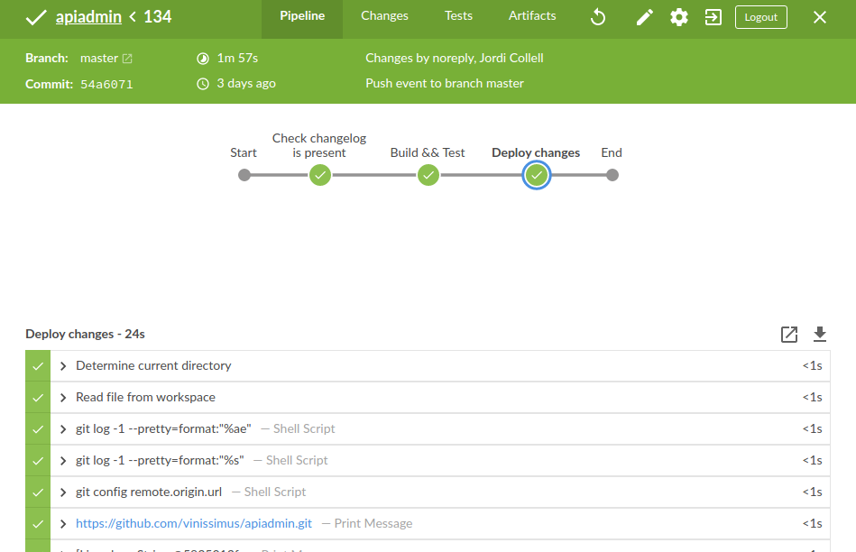

# Our Continuous integration design
> pub_date: 27/07/2020
> keywords: jenkins, CI/CD, piepelans, infraestructure as code

Two years ago, when we started the project of moving the old legacy system to something that can be fully managed and deployed by a team, we realized that the first piece we need was a CD/CI delivery system.

We had adopted Jenkins, because we know it, and also we are more or less proficient with jenkinsfiles and pipelines.

Our source code, lives on private or public github repos, and we use the jenkins oauth plugin, to manage authorization on jenkins.

The first decision we made (at the begining we were still not on a kubernetes cluster) was to build everything on jenkins around Docker containers. Every merged PR on a component repo creates a docker image, we use this image to run tests on it, and also to ensure some code quality, running linters. This way we can ensure that at least, introduced changes, doesn't brake anything already there. A PR can only be merged to **master** branches if all checks are green, and this integrates so well with github.

Testing on this side is done using real services (we use pytest-docker-fixtures) that allow us to test things with real docker containers. For example, all tests that need to use a database,
are run using the postgresql fixture, creating the schema, running the migrations, and doing real inserts/updates/ and deltes on the db. Same happens with redis, elasticsearch or rabbitmq.

On this side, we must say that we fully opted for docker. We run jenkins on docker, and we mount the docker socket on every run. With this, we can build the images and use them from between
the docker jenkins container running. Our jenkins machine, it's hosted on a cheap provider, and it has only one prupose, (run and build docker images)

We like a lot the infrastructure as code idea, and on every component, (github repo) we have a Jenkinsfile, that expresses the steps we need to do, to fully build, test and run the image.

Later, when we moved to kubernetes, we started adding a step, that creates the yaml for the service, and pushes it to a central repository
where we store everything we need to run the cluster. We don't use helm, we just build the desired yamls (services, deployments, crons, jobs) (with jinja like templates on every repo), and we push it as a new commit to our central infraestructure declarative repo. The final step, takes this generated yaml, and applies them to the staging cluster: `kubectl apply -f xxxx.yaml`

After the commit is done and the task is green, we launch a parallel task, that runs the minium selenium tests to ensure a minium runnable component. (We use robotframework and also cypress). Also every day at midnight there is a jenkins job, that runs all the desired tests (This is also used before doint real deployments to production).

Everything happening at jenkins, it's reflected at github commits, and also pushed at a #jenkins channel that we have in our rocket chat service.

# Benefits

- Multiple teams can work on multiple components, and we know, that there is
a place where everything is reflected and autodeployed. (Continuous integration).

- We run daily, and on premise, selenium jobs to ensure component integration,
and QA for the overall system.

- Small components, without too much dependencies, or that don't affect
the main product, can be deployed as needed to production. (If something goes wrong we can rollback the service)

- The pipleine is consistent across all components and teams (every repo has a Jenkinsfile that describes/declares) it's own deployment strategy.

- We have an staging cluster (that it's almost the same that the production one).
  with less resources available to it.

- We regulary dump the (production db), after anonymizing it, to the staging db.
This can be done if a big db change is tryied to be deployed, and it's as easy
as mounting the snapshot of the db disk on a postgres pod, anoynmize it throught sql,
and replace the disk, for the running one.

